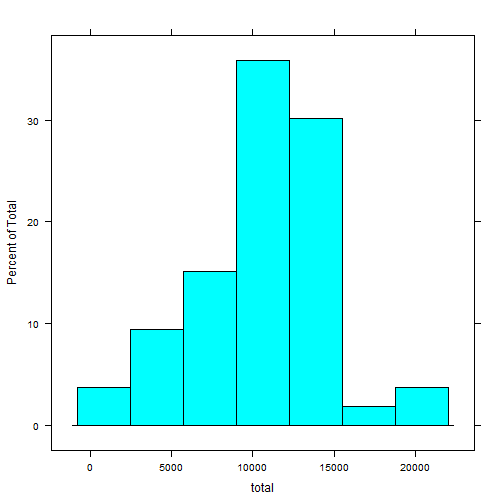

# Reproducible Research: Peer Assessment 1


## Loading and preprocessing the data

```r
  library(plyr)
  library(lattice)
  unzip("activity.zip")
  activity <- read.csv("activity.csv")
  activity$date <- as.Date(activity$date)
```


## What is mean total number of steps taken per day?

```r
  steps.mean.day <- ddply(activity, .(date), summarize, mean = mean(steps))
  histogram(~mean, steps.mean.day)
```

 


## What is the average daily activity pattern?

```r
  activity.clean <- activity[!is.na(activity$steps),]
  steps.mean.interval <- ddply(activity.clean, .(interval), summarize, mean = mean(steps))
  xyplot(mean~interval, data=steps.mean.interval, type="l")
```

 

```r
  steps.mean.interval$interval[which.max(steps.mean.interval$mean)]
```

```
## [1] 835
```


## Imputing missing values


## Are there differences in activity patterns between weekdays and weekends?
