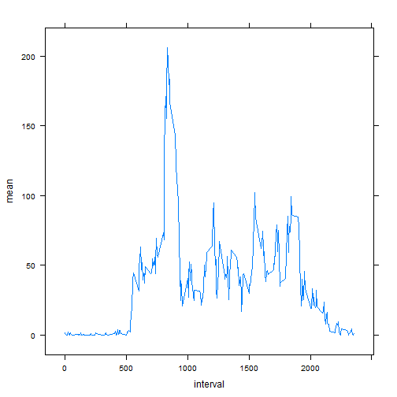

# Reproducible Research: Peer Assessment 1


## Loading and preprocessing the data

```r
  library(plyr)
  library(lattice)
  unzip("activity.zip")
  activity <- read.csv("activity.csv")
  activity$date <- as.Date(activity$date)
```


## What is mean total number of steps taken per day?

```r
  activity.clean <- activity[!is.na(activity$steps),]
  steps.day <- ddply(activity.clean, .(date), summarize, total = sum(steps))
  histogram(~total, steps.day)
```

 

```r
  mean(steps.day$total)
```

```
## [1] 10766
```

```r
  median(steps.day$total)
```

```
## [1] 10765
```


## What is the average daily activity pattern?

```r
  steps.interval <- ddply(activity.clean, .(interval), summarize, mean = mean(steps))
  xyplot(mean~interval, data=steps.interval, type="l")
```

 
  
The interval with the maximum mean steps was:

```r
  steps.interval$interval[which.max(steps.interval$mean)]
```

```
## [1] 835
```
with its mean steps:

```r
  steps.interval$mean[which.max(steps.interval$mean)]
```

```
## [1] 206.2
```


## Imputing missing values
Missing values were imputing by using each interval's overall mean steps in each interval missing a step value.

```r
  missing <- activity[is.na(activity$steps),]
  missing.index <- is.na(activity$steps)
  missing.count <- nrow(missing)
  activity.imp <- activity
  activity.imp$steps[missing.index] <- unlist(sapply(activity$interval[missing.index], function(x) {steps.interval$mean[steps.interval$interval == x]}))
  steps.day.imp <- ddply(activity.imp, .(date), summarize, total = sum(steps))
  histogram(~total, steps.day.imp)
```

 

```r
  mean(steps.day.imp$total)
```

```
## [1] 10766
```

```r
  median(steps.day.imp$total)
```

```
## [1] 10766
```
The median differs slightly from before because we added more entries using the mean steps in each interval, driving the median towards the mean.

## Are there differences in activity patterns between weekdays and weekends?

```r
  activity.wd <- activity.imp
  weekends <- function(d)
    {
      weekend <- c("Saturday","Sunday")
      if (weekdays(d) %in% weekend)
        "weekend"
      else
        "weekday"
    }
  activity.wd <- cbind(activity.wd, sapply(activity.wd$date, weekends))
  colnames(activity.wd)[length(activity.wd)] <- "weekday"
  steps.interval.wd <- ddply(activity.wd, .(interval, weekday), summarize, mean = mean(steps))
  xyplot(mean~interval | weekday, data=steps.interval.wd, type="l", panel=panel.xyplot, layout=c(1,2))
```

 
